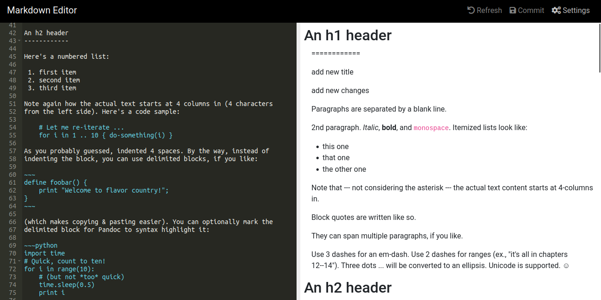

            # Gn-markdown-editor

Gn-markdown-editor  is a tiny web tool to preview Markdown formatted text.


##  Running only the UI
for quick setup without server processing run

python -m http.server


## Run local testing server

use guix;etc to load the requirements(python,flask and markdown)

using guix

```
guix shell -CN -Df  guix.scm

```
```
python -m main

```


### example on how to edit a markdown page

*NB:edit the config file to provide to your github access token*


```
{{SERVER_URL}}/?refresh_link=https://github.com/{{user_name}}/{{repo_name}}/blob/{{branch}}/{{file_name}}

e.g 
http://127.0.0.1:5000/?refresh_link=https://github.com/Alexanderlacuna/data-vault-2/blob/master/README.md

```





## Acknowledgments

This project relies on several  libraries and tools. We would like to express our gratitude to the following  projects:


- [Ac ](https://github.com/ajaxorg/ace) - Ace is a standalone code editor written in JavaScript

- [markedjs](https://marked.js.org/) - A markdown parser and compiler. Built for speed.


## Features
* edit markdown,preview and commit changes to github repo

## TODOS

[] add full resize functionality for browser and render page

[] full editor customization like color scheme,key bindings 


## License
see License File


